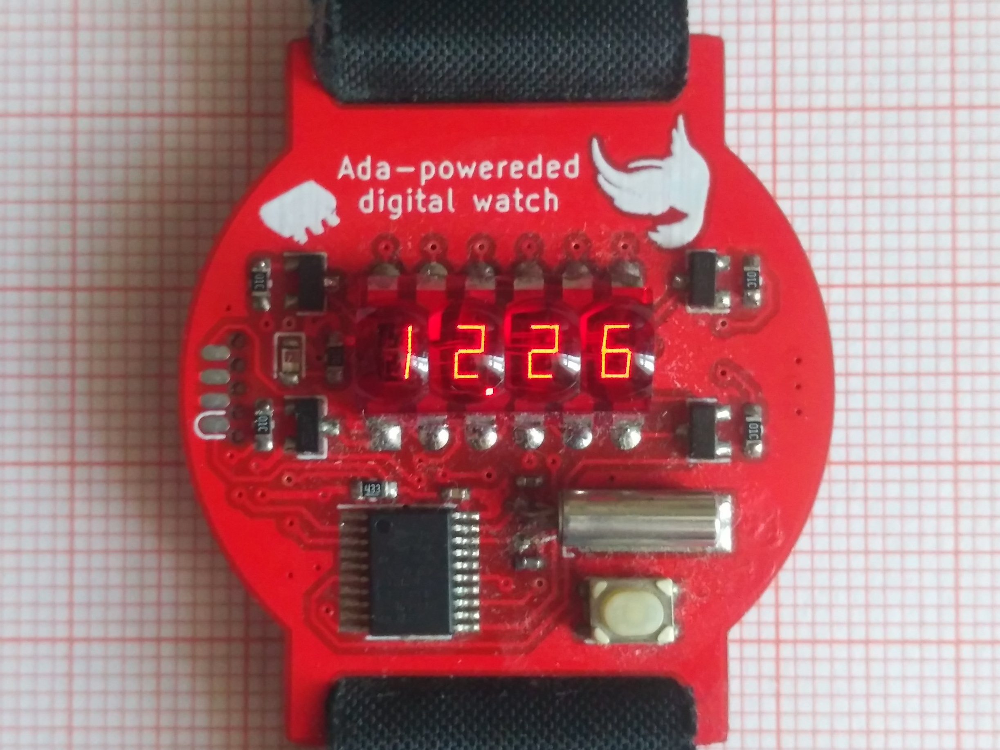
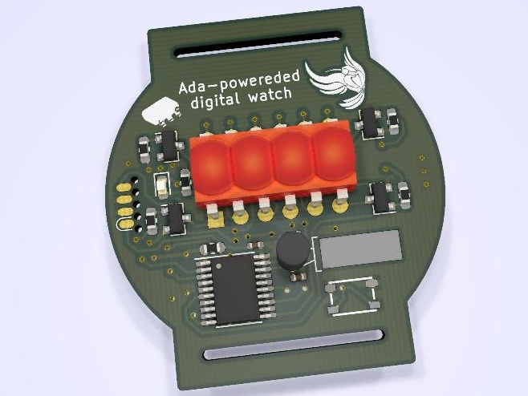

# Ada-powereded digital watch

This repository contains Schematics, KiCad design files and software for Ada-powereded digital watch.
It uses wonderful work of [msp430-ada project](https://sourceforge.net/projects/msp430ada/) by Brian Drummond.
Software for this watch is a modification of original project and it will be further modified to add missing
features like automatic brightness, temperature reading and Easter egg.

## Warning - project in progress!

Revision 1 of the PCB is being tested and following problems were found:

- Incorrect footprint of CR2032 Battery holder
- THT Crystal footprint is too big and will be replaced with Epson MC-146 32kHz Crystal

GCC compiler for building this project can be found in this repository. It was build on CentOS 6 x64 and should work with any 64-bit modern GNU/Linux distribution.
Docker image for it is still in progress.

## BOM and assembly instructions
In progress

# License
GPL (Same as MSP430-Ada project)
