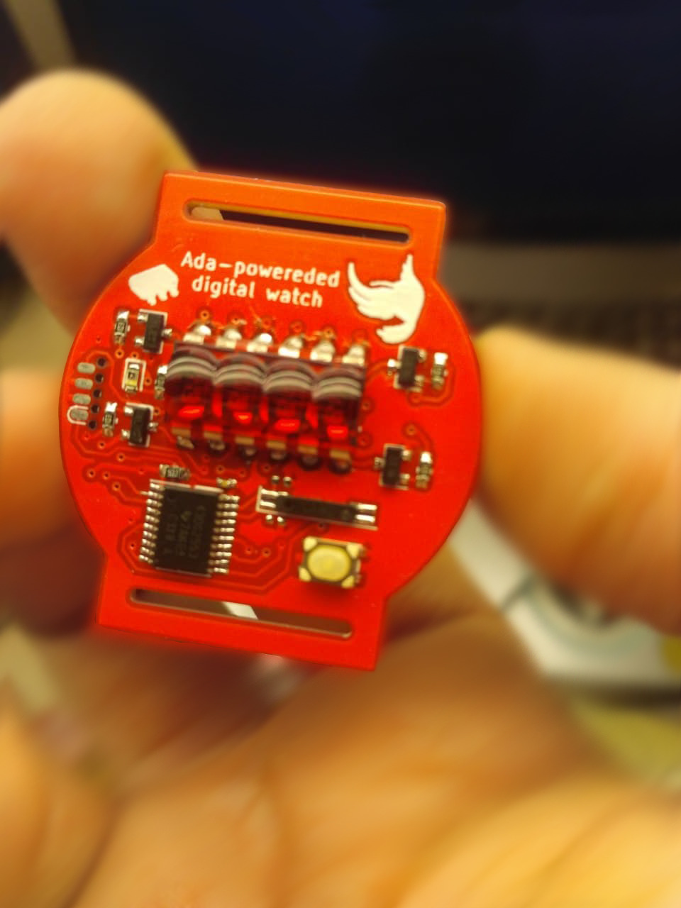

# Ada-powereded digital watch

This repository contains Schematics, KiCad design files and software for Ada-powereded digital watch.
It uses wonderful work of [msp430-ada project](https://sourceforge.net/projects/msp430ada/) by Brian Drummond.
Software for this watch is a modification of original project and adds missing
features like automatic brightness, temperature reading and Easter Egg.

Revision 1 of the PCB was tested and following problems have been found:

- Incorrect footprint of CR2032 Battery holder
- THT Crystal footprint is too big and will be replaced with Epson MC-146 32kHz Crystal

Revision 2 fixed those problems and after about year of testing it haven't showed other flaws.
More photos and renders can be found in `photos` folder.

GCC compiler for building this project can be found in this repository. It was built on CentOS 6 x64 and should work with any modern 64-bit GNU/Linux distribution.
Docker image for it is still in progress as it requires exact same version of host GCC and patches from MSP430-Ada project.

## BOM and assembly instructions
Interactive BOM can be found [here](hardware/rev2/bom/ibom.html).

Remember to start with SMD components. Program the MSP430, put the display in place and
test it before soldering it to the board.

Case can be 3D printed with semi-transparent material or cut from thin PMMA.

The best way to program the microcontroller is to use [SOICBite](https://github.com/SimonMerrett/SOICbite) connected
to MSP430-G2 Launchpad. Pin layout can be found in the schematic and only TEST, RST, GND and 3V need to be used to program it.
After connecting the SOICBite, `make flash` command can be used. It uses `mspdebug` program and works only on GNU/Linux environment.
The firmware binary can be found in `firmware/obj` folder.

# License
GPL (Same as MSP430-Ada project)
